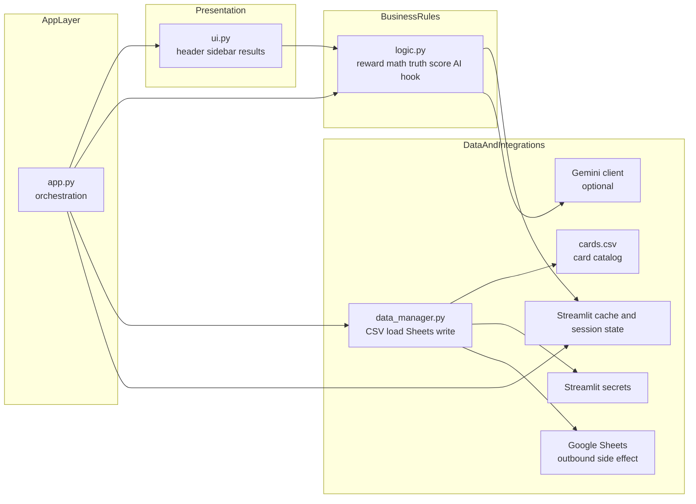

# CredLens Architecture

## Purpose
CredLens is a Streamlit recommendation engine that ranks credit cards against a user's monthly spending profile. The app is driven by CSV-configured card metadata in `cards.csv`, personalized sidebar inputs collected in `ui.py`, ranking and scoring logic in `logic.py`, and orchestration in `app.py`.

This document explains the current codebase from three angles:
- module ownership
- runtime flow
- data contracts between layers

## Module Map
### `app.py`
- Entry point and orchestration layer.
- Initializes `st.session_state`.
- Loads UI chrome and card data.
- Collects sidebar input from `ui.render_sidebar()`.
- Runs eligibility filtering and ranking.
- Builds current-card comparison state.
- Calls verdict and truth-score helpers.
- Sends fully prepared data to `ui.render_results()`.
- Triggers Google Sheets lead logging with throttling.

### `ui.py`
- Presentation layer.
- Owns Streamlit page styling, header, sidebar, and results rendering.
- `render_sidebar()` normalizes user input into a dict for the rest of the app.
- `render_results()` is the heavy renderer and also derives some display-only summaries from the winning card and spend profile.
- Imports `logic.format_inr`, so the presentation layer depends on a small utility from the business layer.

### `logic.py`
- Business rules layer.
- Calculates per-card net savings from spend categories and CSV rules.
- Handles reward exclusions, normalization, caps, fee waivers, and truth-score interpretation.
- Exposes both the ranking metric (`calculate_card_yield`) and the secondary interpretive score (`build_credlens_truth_insight`).
- Contains optional Gemini integration through `get_ai_verdict()`, but the UI currently keeps AI disabled.

### `data_manager.py`
- Data access and integration layer.
- Loads `cards.csv`, trims column names, and injects safe defaults for expected columns.
- Writes lead snapshots to Google Sheets using Streamlit secrets.

### `cards.csv`
- Configuration and data layer.
- Defines card economics, eligibility, reward rates, reward constraints, and UI metadata.
- Functions as a lightweight rules engine because much of the recommendation behavior is data-driven.

## Effective Layering
- Orchestration: `app.py`
- Presentation: `ui.py`
- Business rules: `logic.py`
- Data access / integrations: `data_manager.py`
- Configuration / card catalog: `cards.csv`

The layering is mostly clean, but not strict:
- `ui.py` imports `logic.format_inr`.
- `app.py` still owns comparison-state business rules.
- `ui.py` contains some derived result summaries that are not purely visual.

## Runtime Flow
The current runtime starts in `main()` in [app.py](/Users/admin/Desktop/CredLens/app.py#L67) and follows this sequence:

1. Streamlit page config is set.
2. `init_session_state()` seeds defaults such as salary, spend buckets, filter flags, and the `results_visible` toggle.
3. `ui.render_custom_css()` and `ui.render_header()` prepare the page shell.
4. `data_manager.load_card_data()` reads `cards.csv`, standardizes headers, and fills fallback columns.
5. `ui.render_sidebar()` returns a normalized `user_inputs` dict.
6. If the user clicked the recommendation button, `results_visible` becomes `True`.
7. When results are visible, `run_recommendation_flow()`:
   - filters cards by `Min Income`
   - optionally filters by `Lounge Access`
   - computes `Net Savings` for every remaining card with `logic.calculate_card_yield()`
   - sorts descending by `Net Savings`
8. If there are valid cards, `app.py` selects the top row as `best_card`.
9. `app.py` builds one comparison scenario for the user's current card:
   - `no_card`
   - `same_card`
   - `switch`
   - `no_card_lounge`
10. `app.py` builds result metadata:
    - `logic.get_credlens_verdict()`
    - `logic.build_credlens_truth_insight()`
11. `ui.render_results()` renders the recommendation, explanations, and supporting comparisons.
12. `data_manager.save_lead_to_sheets()` is called if at least 10 seconds have passed since the last save.
13. If no results are visible yet, the app shows an informational empty state instead of ranking cards.

## Runtime Flowchart
```mermaid
flowchart TD
    A[User opens app] --> B[app.main()]
    B --> C[init_session_state()]
    C --> D[ui.render_custom_css and ui.render_header]
    D --> E[data_manager.load_card_data]
    E --> F[ui.render_sidebar]
    F --> G{Calculate button pressed?}
    G -- Yes --> H[Set session_state.results_visible = True]
    G -- No --> I{results_visible already True?}
    H --> J{results visible?}
    I -- Yes --> J
    I -- No --> Z[Show initial info state]
    J -- No --> Z
    J -- Yes --> K[Filter by Min Income]
    K --> L{Lounge required?}
    L -- Yes --> M[Filter Lounge Access == Yes]
    L -- No --> N[Skip lounge filter]
    M --> O[Per-card reward calculation via logic.calculate_card_yield]
    N --> O
    O --> P[Sort by Net Savings]
    P --> Q{Any valid cards left?}
    Q -- No --> R[Show no-cards-found error]
    Q -- Yes --> S[Pick best_card]
    S --> T{Current card exists?}
    T -- No card selected --> U[comparison = no_card]
    T -- Yes --> V{Current card equals best_card?}
    V -- Yes --> W[comparison = same_card]
    V -- No --> X[Recalculate current card savings and compare delta]
    X --> Y{Current card survives lounge filter?}
    Y -- No --> AA[comparison = no_card_lounge]
    Y -- Yes and meaningful diff --> AB[comparison = switch]
    Y -- Yes and diff small --> W
    U --> AC[Build verdict and truth insight]
    W --> AC
    AA --> AC
    AB --> AC
    AC --> AD[ui.render_results]
    AD --> AE[Maybe save lead to Google Sheets]
```

## Static Module Interaction


## Data Contracts
### Sidebar output from `ui.render_sidebar()`
Current output shape from [ui.py](/Users/admin/Desktop/CredLens/ui.py#L1653):

```python
{
    "age": int,
    "credit_score": int,
    "salary": number,
    "spends": {
        "online": number,
        "travel": number,
        "offline": number,
        "total": number,
        "utilities": number,
        "upi": number,
    },
    "wants_lounge": bool,
    "enable_ai": bool,
    "ask_ai_clicked": bool,
    "current_card_name": str,
    "calculate_button": bool,
    "max_spend_dict": dict[str, number],
}
```

Notes:
- `age` and `credit_score` are currently hard-coded defaults in the sidebar flow, not active user inputs.
- `dining` exists in `logic.py` and `init_session_state()`, but `render_sidebar()` does not currently include it in the returned `spends` dict.

### Reward calculation contract
`logic.calculate_card_yield_details()` in [logic.py](/Users/admin/Desktop/CredLens/logic.py#L14) returns a detailed dict containing:
- `annual_total_spend`
- `fee_waiver_spend`
- `monthly_raw_reward`
- `monthly_realized_reward`
- `monthly_cap`
- `cap_type`
- `category_monthly_reward`
- `annual_reward_before_fee`
- `fee`
- `effective_fee`
- `fee_waived`
- `net_savings`

`logic.calculate_card_yield()` in [logic.py](/Users/admin/Desktop/CredLens/logic.py#L104) is a thin wrapper that returns only `net_savings`. That value is the ranking metric used in `app.py`.

### Truth insight contract
`logic.build_credlens_truth_insight()` in [logic.py](/Users/admin/Desktop/CredLens/logic.py#L421) returns:
- `score`
- `label`
- `tone`
- `badges`
- `reward_value`
- `realization_type`
- `cap_type`
- `fee_waived`
- `exclusion_categories`

This is not used for ranking. It is a second interpretive layer for the result UI.

### CSV fields that materially affect flow
Current `cards.csv` columns used directly or indirectly by the main flow:

- Eligibility:
  - `Min Income`
- Economics:
  - `Fee`
  - `Fee_Waiver_Spend`
  - `Monthly Cap`
  - `Reward_Value`
- Reward rates:
  - `Base Rate`
  - `Online Rate`
  - `Dining Rate`
  - `Travel Rate`
  - `Utility Rate`
  - `UPI Rate`
- Reward constraints:
  - `Reward_Cap_Type`
  - `Reward_Exclusion_Categories`
- UX and explanatory metadata:
  - `Card Name`
  - `Image_URL`
  - `Apply_Link`
  - `Pro_Reason`
  - `Con_Reason`
  - `Status`
  - `Warning_Text`
  - `Market_Rating`
  - `Lounge Access`

## Core Business Logic
### Ranking metric
The ranking metric is `Net Savings`, computed in [logic.py](/Users/admin/Desktop/CredLens/logic.py#L14):

1. Read monthly spend categories from the input dict.
2. Read reward rates from the card row.
3. Remove rewards from excluded categories defined in `Reward_Exclusion_Categories`.
4. Convert theoretical rewards into realistic value using `Reward_Value`.
5. Apply reward caps using `Reward_Cap_Type` and `Monthly Cap`.
6. Convert monthly realized reward into annual reward.
7. Reduce annual value by the effective fee after fee-waiver logic.
8. Return `net_savings`.

### Interpretive score
The truth score is computed separately in [logic.py](/Users/admin/Desktop/CredLens/logic.py#L407):
- start from `100`
- subtract ROI penalty
- subtract cap penalty
- subtract reward-friction penalty
- subtract fee penalty
- subtract devaluation penalty

This means:
- `Net Savings` decides ranking
- truth score explains quality and realism
- the top-ranked card is not necessarily the highest truth-score card

## Comparison Logic
Current comparison handling lives in [app.py](/Users/admin/Desktop/CredLens/app.py#L136):

- `no_card`
  - User selected `"I don't have a card"`.
- `same_card`
  - User already holds the winning card, or the computed difference is too small to matter.
- `switch`
  - User has a different eligible card and the annual difference is greater than `100`.
- `no_card_lounge`
  - The selected current card exists in the catalog but is filtered out by the lounge requirement.

This comparison logic is business behavior sitting in the orchestration layer rather than in `logic.py`.

## Side Effects And Integrations
### Streamlit state and caching
- `init_session_state()` in [app.py](/Users/admin/Desktop/CredLens/app.py#L12) stores defaults and keeps results visible across reruns.
- `load_card_data()` in [data_manager.py](/Users/admin/Desktop/CredLens/data_manager.py#L7) uses `@st.cache_data(ttl=60)`.
- `get_ai_verdict()` in [logic.py](/Users/admin/Desktop/CredLens/logic.py#L110) uses `@st.cache_resource(show_spinner=False)`.

### Google Sheets lead logging
- `save_lead_to_sheets()` in [data_manager.py](/Users/admin/Desktop/CredLens/data_manager.py#L61) is an outbound side effect.
- It depends on `st.secrets["gcp_service_account"]`.
- `app.py` throttles calls with `last_save_time` so repeated reruns do not spam the sheet.

### Gemini integration
- `logic.get_ai_verdict()` can call Gemini when API secrets are present.
- The current sidebar sets `enable_ai = False` and `ask_ai_clicked = False`, so the feature is effectively disabled in normal flow.

## Public Entry Points And Important Helpers
### Main entry points
- [main()](/Users/admin/Desktop/CredLens/app.py#L67)
- [render_sidebar()](/Users/admin/Desktop/CredLens/ui.py#L1653)
- [render_results()](/Users/admin/Desktop/CredLens/ui.py#L1834)
- [load_card_data()](/Users/admin/Desktop/CredLens/data_manager.py#L8)
- [calculate_card_yield_details()](/Users/admin/Desktop/CredLens/logic.py#L14)
- [calculate_card_yield()](/Users/admin/Desktop/CredLens/logic.py#L104)
- [get_credlens_verdict()](/Users/admin/Desktop/CredLens/logic.py#L143)
- [build_credlens_truth_insight()](/Users/admin/Desktop/CredLens/logic.py#L421)

### Key internal helpers in `logic.py`
- [_get_excluded_categories()](/Users/admin/Desktop/CredLens/logic.py#L176)
- [_apply_monthly_cap()](/Users/admin/Desktop/CredLens/logic.py#L201)
- [_reward_friction_penalty()](/Users/admin/Desktop/CredLens/logic.py#L270)
- [_cap_penalty()](/Users/admin/Desktop/CredLens/logic.py#L299)
- [_fee_penalty()](/Users/admin/Desktop/CredLens/logic.py#L335)
- [_effective_fee()](/Users/admin/Desktop/CredLens/logic.py#L346)
- [assign_credlens_badges()](/Users/admin/Desktop/CredLens/logic.py#L375)
- [calculate_truth_score()](/Users/admin/Desktop/CredLens/logic.py#L407)

## Decision Points That Matter
- Are results currently visible, or should the app remain in the empty state?
- Does the card pass salary eligibility?
- Is lounge access required?
- How much annual value survives exclusions, reward-value adjustment, and caps?
- Does annual spend waive the fee?
- Is the user's current card the same as the winning card, worth switching from, or filtered out?
- Should the app persist the result to Google Sheets on this rerun?

## Current Design Tradeoffs
- `ui.py` is very large and mixes rendering with some display-side derivation, especially inside `render_results()`.
- `app.py` is a clean orchestrator overall, but it still owns comparison-state rules instead of delegating them.
- `logic.py` is the real decision engine and is the safest place to inspect when recommendation behavior looks wrong.
- `cards.csv` acts like a configurable rules engine; changing CSV values can materially change ranking without code changes.
- AI is wired in but effectively off in the current user flow.
- There is a small contract mismatch today: `logic.py` can score `dining`, but the active sidebar output does not pass a `dining` spend value.

## Validation Checklist
Use this checklist when reading or extending the app:

1. Initial load shows the informational empty state because `results_visible` is still `False`.
2. A normal recommendation run filters by salary, computes `Net Savings`, sorts, and renders the winner.
3. A lounge-filtered run applies `Lounge Access == Yes` before ranking and can also affect current-card comparison.
4. A user with no current card follows the `no_card` comparison path.
5. A user already holding the top recommendation follows the `same_card` path.
6. A user holding a different card triggers recomputation of current-card savings and a delta check.
7. No valid cards after filtering produces the error state instead of the result UI.
8. Meeting `Fee_Waiver_Spend` makes `effective_fee` become `0`.
9. `Reward_Cap_Type`, `Monthly Cap`, and `Reward_Exclusion_Categories` explain why realized value can be lower than theoretical reward rate output.
